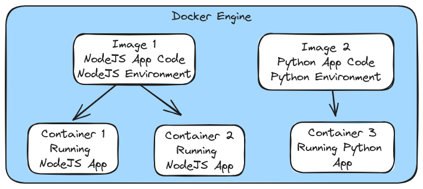

# Docker Images & Containers - Core Building Blocks

## Key Topics

- Two Core Concepts: Images & Containers
- Using Pre-built & Custom Images
- Creating & Managing Containers

## Images & Containers

**Image:** Templates/ Blueprints for container & Contains code + required tools/ runtime<br />
**Containers:** The running "unit of software"



## Running Docker Images

**Using a Prebuilt Image**<br />
To start the NodeJS image from [Docker Hub](https://hub.docker.com/_/node), use one of the following commands:

```bash
  docker run node
  docker run -it node   # Run with interactive shell
```

**Building and Running a Custom Image**<br />
Follow these steps to build an image from a Dockerfile and run a container from it:

1. Build the Docker Image: `docker build .`<br />
   Ths will build an image from a Dockerfile and output an `ImageID` for the created image.<br />
2. Run a Container from the Built Image: `docker run -p 8000:800 <ImageID>`<br />
   Use the `ImageID` to run a container from the built image and map port 8000 on the host to port 80 in the container.

This process will create and run a container based on the specifications provided in a Dockerfile, and it will map port 8000 on the local machine to port 80 in the container.

## Managing Images & Containers

| Images              | Command or Flag            | Containers                      | Command or Flag           |
| ------------------- | -------------------------- | ------------------------------- | ------------------------- |
| Can be **tagged**   | _-t, docker tag_           | Can be **named**                | _--name_                  |
| Can be **listed**   | _docker images_            | Can be **configured in detail** | see _--help_              |
| Can be **analyzed** | _docker image inspect_     | Can be **listed**               | _docker ps, docker ps -a_ |
| Can be **removed**  | _docker rmi, docker prune_ | Can be **removed**              | _docker rm_               |

Add `--help`to see all options.
