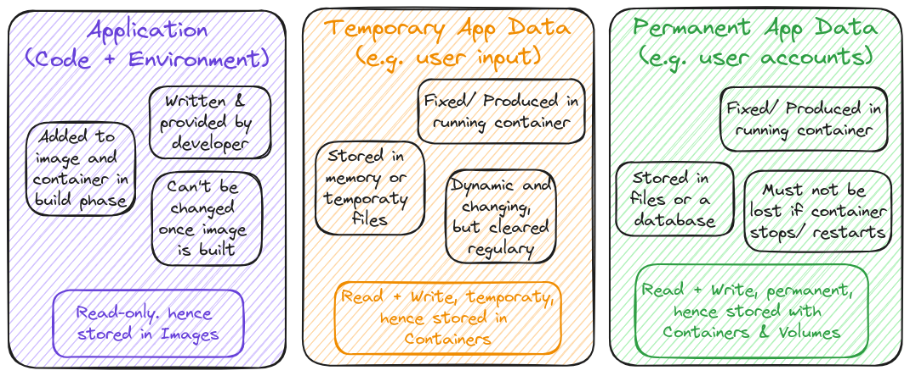
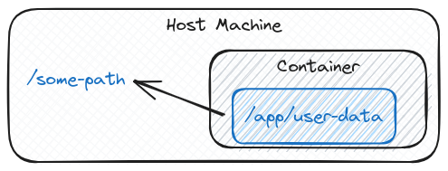
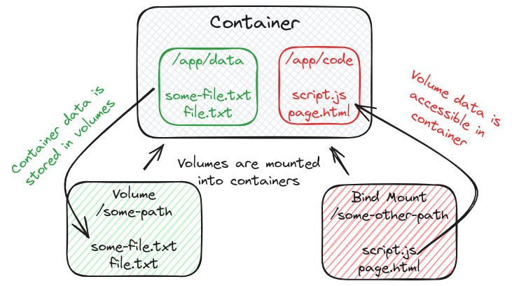

# Managing Data & Working with Volumes

## Key Topics

- Understanding Different Kinds of Data
- Images, Containers & Volumes
- Using Arguments & Environment Variables

## Different Kinds of Data

## Volumes

### Understanding Volumes

Volumes are _folders on the host machines_ hard drive which are _mounted_ ("made available", mapped) _into containers_

Volumes persist if a container shuts down. If a container (re-)starts and mounts a volume, any data inside of that volume is available in the container. 
A container can write data into a volume and read data from it.

### Types of External Data Storages

<table>
  <thead>
    <tr>
      <th colspan=2>Volumes</th>
      <th>Bind Mounts</th>
    </tr>
  </thead>
  <tbody>
    <tr>
      <td><strong>Anonymous Volumes</strong></td>
      <td><strong>Named Volumes</strong></td>
      <td></td>
    </tr>
    <tr>
      <td colspan=2>Docker sets up a folder/ path on the host machine, exact location is unknown. Managed via <em>docker volume</em> commands</td>
      <td>Predefined folder/ path on the host machine.</td>      
    </tr>
    <tr>
      <td colspan=3>A defined path in the container is mapped to the created volume/ mount. For example: <em>/some-path</em> on the hosting machine is mapped to <em>/app/data</em>.</td>
    </tr>
    <tr>
      <td></td>
      <td>Great for data which should be persistent but which you don’t need to edit directly.</td>
      <td>Great for persistent, editable data. <em>(e.g. source code)</em>.</td>
    </tr>
  </tbody>
</table>

**Volume Interactions** 

### Quick Overview

- Anonymous Volume => `docker run -v /app/data ...`.
  - Created specifically for a single container
  - Survives container shutdown / restart unless `--rm` is used
  - Can not be shared across containers
  - Since it’s anonymous, it can’t be re-used (even on same image)
- Named Volume => `docker run -v data:/app/data ...`.
  - Created in general – not tied to any specific container
  - Survives container shutdown / restart –removal via Docker CLI
  - Can be shared across containers
  - Can be re-used for same container (across restarts)
- Bind Mount => `docker run -v /path/to/code:/app/data ...`.
  - Location on host file system, not tied to any specific container
  - Survives container shutdown / restart –removal on host fs
  - Can be shared across containers
  - Can be re-used for same container (across restarts)

## Arguments & Environment Variables

Docker supports built-time Arguments and runtime environment variables

- Arguments => ARG
  - Available inside of Dockerfile, NOT accessible in CMD or any application code
  - Set on image build (_docker build_) via `--build-arg`
- Environment variables => ENV
  - Available inside of Dockerfile & in application code
  - Set via ENV in Dockerfile or via `--env` on docker run
