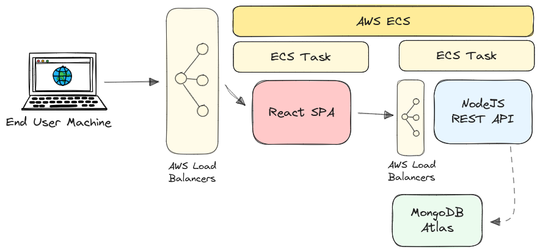

# Deploying Docker Containers

**From Development to Production**

## Key Topics

- Deployment Overview & General Process
- Deployment Scenarios, Examples & Problems

## Development to Production

_What works on your machine (in a containter) will also work after deployment!_ 
**Things to watch out for:**

- Bind Mounts shouldn’t be used in Production!
- Containerized apps might need a build step (e.g. React apps)
- Multi-Container projects might need to be split (or should be split) across multiple hosts/ remote machines
- Trade-offs between control and responsibility might be worth it

## Basic Example - Standalone NodeJS App

Just NodeJS, no database, nothing else => one image & container. 

**Possible Deployment Approach:** Install Docker on a remote host (e.g. via SSH), push and pull image, run container based on image on remote host.

There are hundreds and thousands of Docker-supporting hosting providers out there. The 3 major ones are Amazon Web Services, Microsoft Azure and Google Cloud.

**Deploy to AWS EC2** 
AWS EC2 is a service that allows the user to spin up and manage his own remote machines. 
This is are the necessary steps:

1.  Create and launch EC2 instance, VPC and security group
2.  Configure security group to expose all required ports to WWW
3.  Connect to instance (SSH), install Docker and run container

| Advantages                                                      | Disadvantages                                        |
| --------------------------------------------------------------- | ---------------------------------------------------- |
| Only Docker needs to be installed (no other runtimes or tools!) | Keep essential software updated                      |
| Uploading “source code” is very easy                            | Manage network and security groups/ firewall         |
| Exact same app and environment as on a local machine            | SSHing into the machine to manage it can be annoying |

## Multi-Container Example - Fullstack Application

Remote machines (like _AWS EC2_) require creation, management, updates, monitoring, and scaling. They are best suited for experienced admins or cloud experts. Managed remote machines, like AWS ECS, handle these tasks automatically. This simplifies monitoring and scaling, ideal for straightforward app or container deployment.

**Target Application:** 
A backend implemented in NodeJS with a MongoDB database, alongside a ReactJS frontend. 

### A Single ECS Task for both the Backend and the Database

Managing database containers is possible, but there are challenges to consider. Scaling and maintaining availability can be difficult, performance may degrade during traffic spikes, and handling backups and security can be complex. Using a managed database service such as _AWS RDS_ or _MongoDB Atlas_ can alleviate these issues.

### One ECS Task for both the Backend and Frontend

**Apps with Development Servers & Build steps** 
Some apps or projects require a build step, such as an optimization script, which needs to be executed after development but before deployment. It's important to note that the development setup is not the same as the production setup. For example, a ReactJS app uses a live-reloading development server and unoptimized or unsupported JavaScript features during development. In contrast, the build step or script ensures there is no attached server and produces optimized, fully browser-compatible code.

**Multi-Stage Builds** 
Multi-stage builds in Docker allow you to use a single Dockerfile to define multiple build and setup steps, referred to as "stages." Each stage can copy results, such as created files and folders, from the previous stages. This approach offers flexibility, as you can either build the complete image or select individual stages as needed.

### Separate ECS Tasks for Backend and Frontend

Both the Frontend and Backend expose port 80, which causes a conflict when using a single ECS Task. A common solution is to use two separate ECS Tasks.

## Can it Better?

- Containers enable the encapsulation of application code and its environment for both development and production.
- Considering production requirements demands building containers and application code with additional scenarios in mind, such as multi-stage builds.
- When Docker and remote machines are not managed manually, it is essential to adhere to the tools and rules set by the managed service.
- Different cloud providers impose different rules.

Depending on the provider, implementing features like load balancing can be challenging, making **_Kubernetes_** a preferred solution.

## Useful Resources

- [Amazon Web Services - Home Page](https://aws.amazon.com/)
- [Amazon Web Services - Documentation](https://docs.aws.amazon.com/)
- [Amazon EC2 - Documentation](https://docs.aws.amazon.com/ec2)
- [Amazon ECS - Documentation](https://docs.aws.amazon.com/ecs/)
- [Getting Started with AWS](https://academind.com/tutorials/aws-the-basics)
