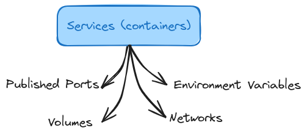

# Docker Compose - Elegant Multi-Container Orchestration

## Key Topics

- What is Docker Compose
- Using Docker Compose

## Docker Compose

One Configuration File + Orchestration Commands (build, start, stop,...) 
Docker Compose does NOT replace Dockerfiles for custom Images 
Docker Compose does NOT replace Images or Container 
Docker Compose is NOT suited for managing multiple containers on different hosts (machines)

**Writing Docker Compose File**

