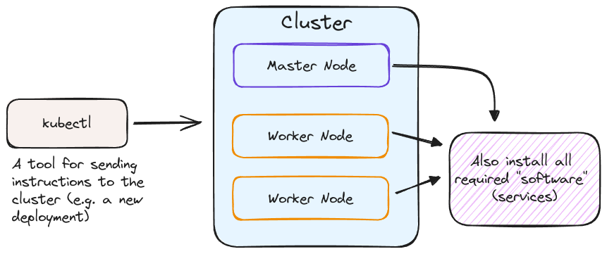
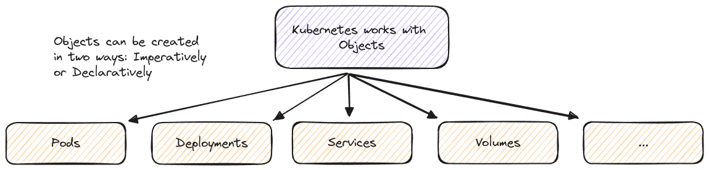
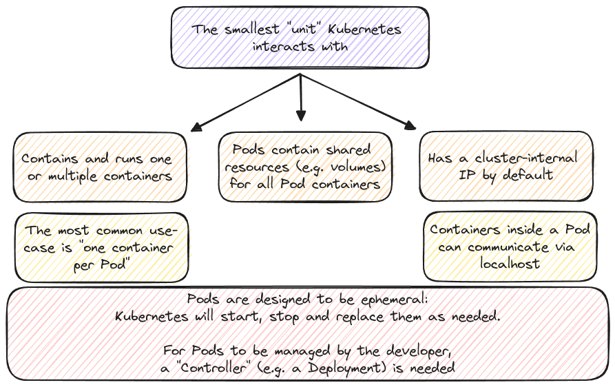
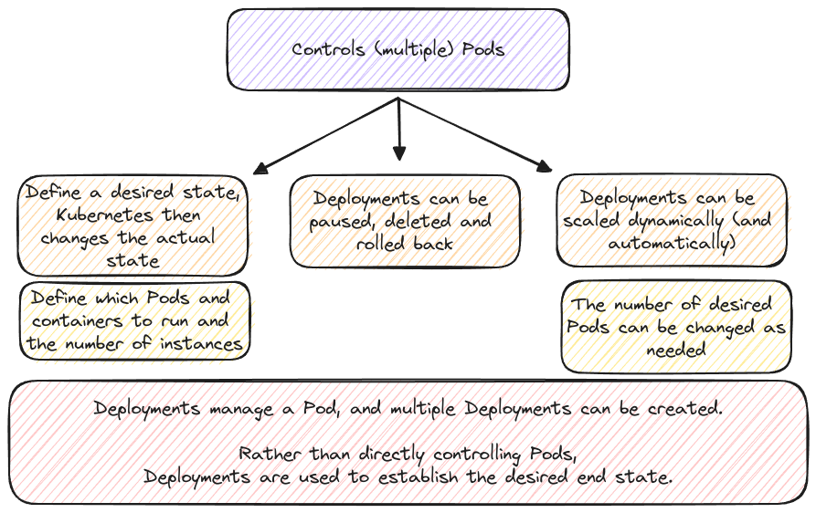

# Kubernetes - Core Concepts

## Key Concepts

- Kubernetes & Testing Environment Setup
- Working with Kubernetes Objects
- Examples!

## Installation



Setting up a local (development cluster): [minikube](https://minikube.sigs.k8s.io/docs/)<br />
The Kubernetes command-line tool: [kubectl](https://kubernetes.io/docs/tasks/tools/#kubectl)

## Kubernetes Objects



### The "Pod" Object



### The "Deployment" Object



## Imperative Approach

```bash
# create an image (e.g. kub-first-app) and push it to docker hub
docker build -t kub-first-app .
docker tag kub-first-app <docker_hub>/kub-first-app
docker push <docker_hub>/kub-first-app

# create a deployment
kubectl create deployment first-app --image=<docker_hub>/kub-first-app

# view all pods
kubectl get pods
```
