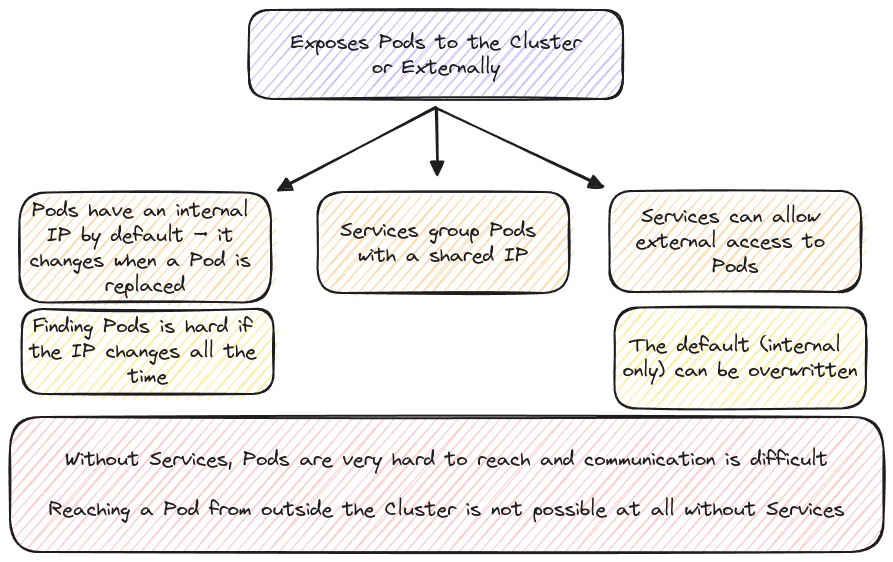
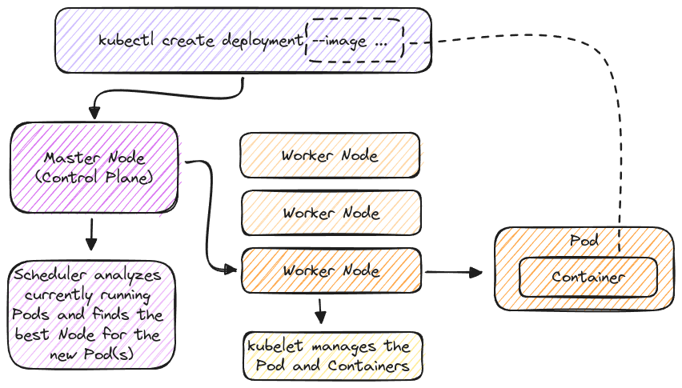

# Kubernetes - Core Concepts

## Key Concepts

- Kubernetes & Testing Environment Setup
- Working with Kubernetes Objects
- Examples!

## Installation


Setting up a local (development cluster): [minikube](https://minikube.sigs.k8s.io/docs/)<br />
The Kubernetes command-line tool: [kubectl](https://kubernetes.io/docs/tasks/tools/#kubectl)

## Kubernetes Objects


### The "Pod" Object


### The "Deployment" Object


### The "Service" Object



## Kubernetes in Action

### Imperative Approach

Individual commands are executed to trigger certain Kubernetes actions. It's comparable to using `docker run` only.

```bash
# create a deployment
kubectl create deployment first-app --image=<docker_hub>/<image>
kubectl get pods              # view all pods

# create a service
kubectl expose deployment first-app --type=LoadBalancer --port=8080
kubectl get services          # view all services
minikube service first-app    # open the application

# update deployment
kubectl set image deployments/first-app kub-first-app=<docker_hub>/<image>
```

### Declarative Approach

A config file is defined and applied to change the desired state. Comparable to using `docker compose` with compose files.

```bash
# create a deployment & service
kubectl apply -f=deployment.yaml -f=service.yaml
kubectl get services          # view all services
minikube service first-app    # open the application

# delete an object (by file)
kubectl delete -f=deployment.yaml

# delete an object (by selector)
kubectl delete deployments -l group=example-app
```

### Behind the Scenes


