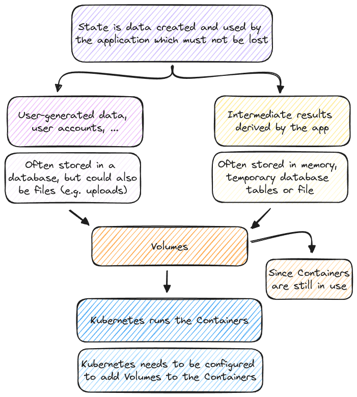

# Managing Data & Volumes with Kubernetes

## Key Concepts

- Volumes
- Persistent Volumes & Persistent Volumes Claims
- Environment Variables

## Kubernetes and Volumes

### Understanding "_State_" & Volumes

