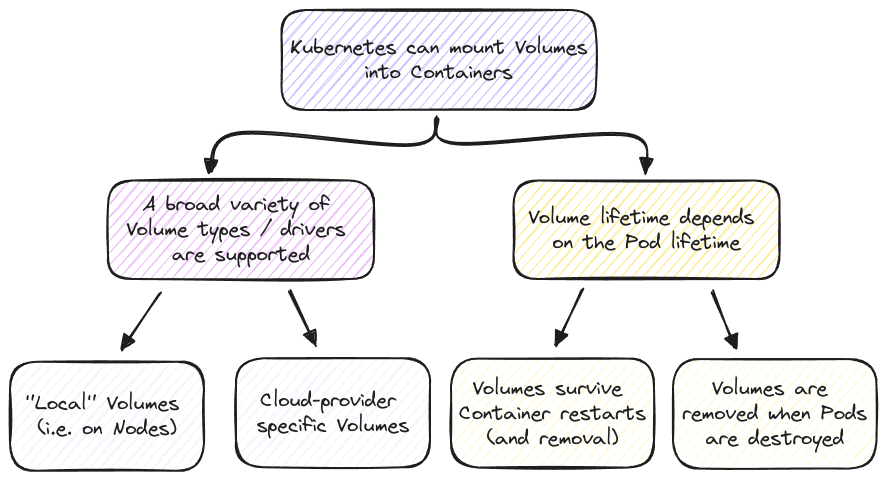
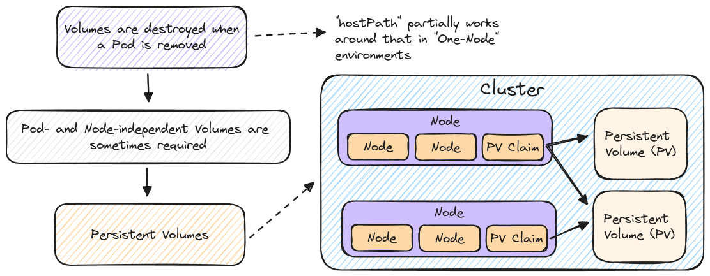

# Managing Data & Volumes with Kubernetes

## Key Concepts

- Volumes
- Persistent Volumes & Persistent Volumes Claims
- Environment Variables

## Kubernetes and Volumes

### Understanding "_State_" & Volumes

### Volumes in Kubernetes

Volumes managed by Kubernetes are not exactly the same as volumes managed by Docker. To be precise, the idea is the same but Kubernetes Volumes are a bit more "powerful".

| Kubernetes Volumes                              | Docker Volumes                                  |
| ----------------------------------------------- | ----------------------------------------------- |
| Supports many different Drivers and Types       | Basically no Driver / Type Support              |
| Volumes are not necessarily persistent          | Volumes persist until manually cleared          |
| Volumes survive Container restarts and removals | Volumes survive Container restarts and removals |

### Persistent Volumes

| "Normal" Volumes                                    | Persistent Volumes                                                   |
| --------------------------------------------------- | -------------------------------------------------------------------- |
| Volume is attached to Pod and Pod lifecycle         | Volume is a standalone Cluster resource (NOT attached to a Pod) |
| Defined and created together with Pod               | Created standalone, claimed via a PVC                                |
| Repetitive and hard to administer on a global level | Can be defined once and used multiple times                          |
