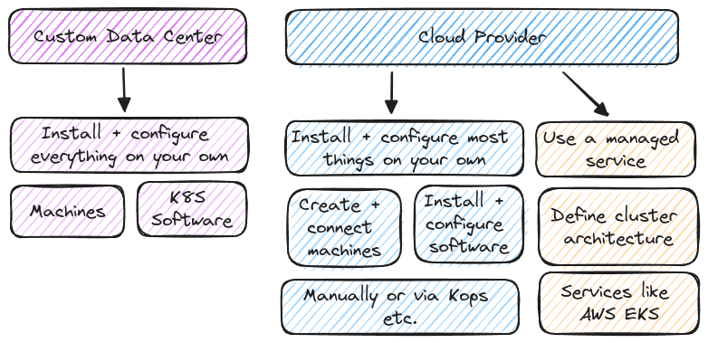

# Kubernetes - Deployment

## Key Concepts

- Deployment Options & Concepts
- Example: AWS EKS

## Deployment Options

### AWS EKS vs AWS ECS

| AWS EKS (Elastic Kubernetes Service)       | AWS ECS (Elastic Container Service)      |
| --------------------------------------------- | ------------------------------------------- |
| Managed service for K8S deployments           | Managed service for Container deployments   |
| No AWS-specific syntax or philosophy required | AWS-specific syntax and philosophy applies  |
| Use standard K8S configurations and resources | Use AWS-specific configuration and concepts |

### Further Resources for AWS EKS Deployment

At this stage, the actual deployment with help of AWS Elastic Kubernetes Service (EKS) is beyond the current scope. However, to proceed with implementation or gain a deeper understanding of the deployment process, you can refer to the following official resources:

- [AWS EKS](https://aws.amazon.com/eks/) - This is the main landing page for AWS EKS, offering an overview of the service, its features, and key benefits.
- [AWS EKS - Official Docs](https://docs.aws.amazon.com/eks/) - This is the comprehensive documentation provided by AWS, containing detailed instructions, best practices, and reference materials for deploying and managing your EKS clusters.

These resources will provide the necessary knowledge for a successful deployment when moving forward with the process.
