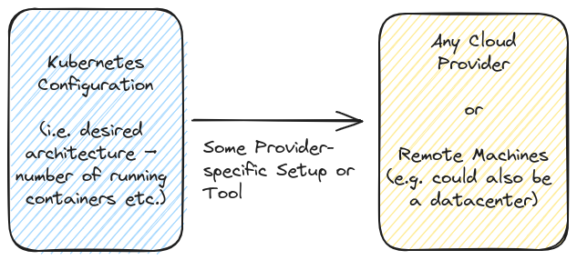

# Getting Started with Kubernetes

## Key Concepts

- Understanding Container Deployment Challenges
- What is Kubernetes? And Why?
- Kubernetes Concepts & Components

## What and Why Kubernetes

### Deployment Problem

Deploying containers manually is challenging, error-prone, and often frustrating, even when not considering security and configuration issues. Here are some common problems:

- Containers can crash or go offline and require replacement.
- Traffic spikes may necessitate additional container instances.
- Incoming traffic needs to be evenly distributed across containers.

Services like _AWS ECS_ provide features such as container health checks, automatic re-deployments, autoscaling, and load balancing. However, relying on a specific cloud service can lead to vendor lock-in. Switching providers would require learning the unique services, configurations, and options offered by the new platform.

### Kubernetes to the Rescue

Kubernetes is an open-source system (and de-facto standard) for orchestrating container deployments. It offers features like automatic deployment, scaling & load balancing, management,...

