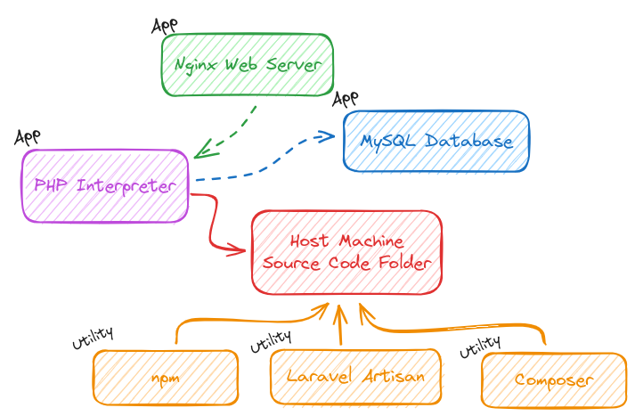

# A More Complex Setup - Laravel & PHP Dockerized Project

**Practice: A Laravel & PHP Setup**<br />
Images, Container, Compose - All in Action

## Target Setup



**Create the Laravel Setup**<br />
Run the following commands to start the necessary containers for building the target application.

1. **Create `src` folder**<br />
   `mkdir src`
2. **Create and Start a Laravel Project**<br />

   ```bash
      # Create a Laravel Project
      docker compose run --rm composer create-project --prefer-dist laravel/laravel .

      # Change Permissions
      sudo chmod -R o+w src/storage src/bootstrap/cache

      # Start the Application
      docker compose up -d server
   ```
