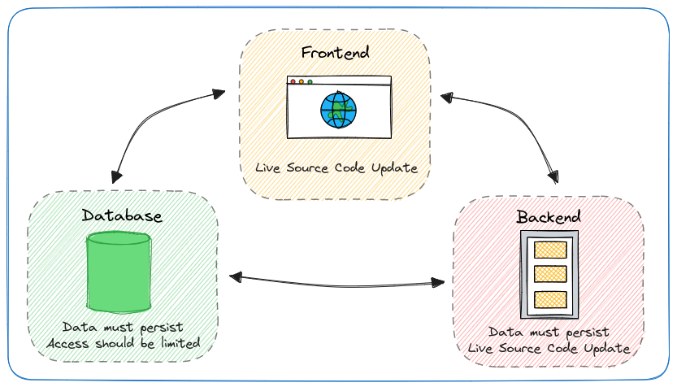

# Building Multi-Container Applications with Docker

## Key Topics

- Combining Multiple Services to One App
- Working with Multiple Containers

## Target Application



### Create the application

Run the following commands to start the necessary containers for building the target application.

1. **Network**<br />
   `docker network create goals-net`

2. **MongoDB Database**<br />

   ```bash
     # Run Container
     docker run \
       --network goals-net \
       -v data:/data/db \
       -e MONGO_INITDB_ROOT_USERNAME=user \
       -e MONGO_INITDB_ROOT_PASSWORD=secret \
       --rm -d --name mongodb \
       mongo
   ```

3. **NodeJS Backend**<br />

   ```bash
     # Build Image
     docker build -t goals-node .

     # Run Container
     docker run \
       --network goals-net \
       -v logs:/app/logs \
       -v $(pwd):/app \
       -v /app/node_modules \
       -e MONGODB_USERNAME=user \
       -p 80:80 \
       --rm -d --name goals-backend \
       goals-node
   ```

4. **ReactJS Frontend**<br />

   ```bash
     # Build Image
     docker build -t goals-react .

     # Run Container
     docker run \
       -v $(pwd)/src:/app/src \
       -p 3000:3000 \
       --rm -d --name goals-frontend \
       goals-react
   ```

### Room for Improvement

- Three, long docker run commands<br />
  It would be great to not have to remember or save those and to avoid running them individually.
- Development-only setup<br />
  Not optimized for production, shouldn’t be executed like this on a production server
