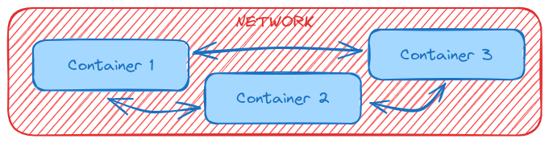

# Networking - (Cross-)Container Communication

## Key Topics

- Containers and External Networks
- Connecting Containers with Networks

## Containers & Network Requests

### Creating Container Networks

Within a Docker network, all containers can communicate with each other and IP addresses are automatically resolved. To run in a container in a network, use the following command: `docker run --network my_network ...`.

