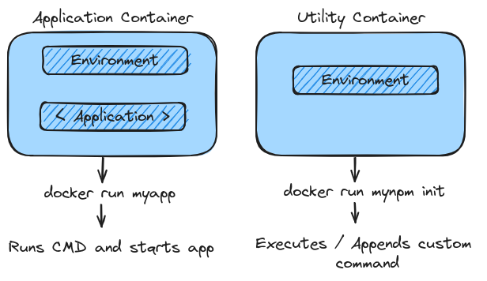

# Utility Containers

## Key Topics

- Working with "Utility Containers"
- Executing Commands in Containers

## What are Utility Containers



### Running Commands inside a container

```bash
  # Start a Container
  docker run -it -d --name nodejs node

  # Execute a Command
  docker exec -it nodejs <COMMAND>
```

### Running a Utility Container

```bash
  # Using 'just' Docker
  docker build -t mynpm .
  docker run --rm -it -v $(pwd):/app mynpm <COMMAND>

  # Using Docker Compose
  docker compose run --rm npm <COMMAND>
```
